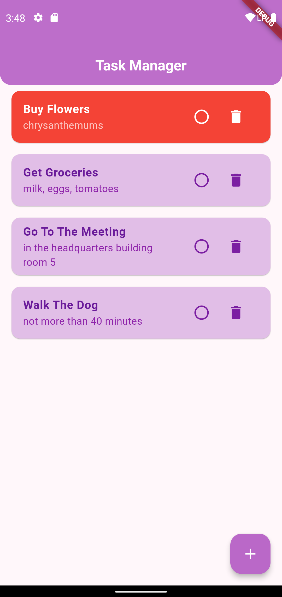
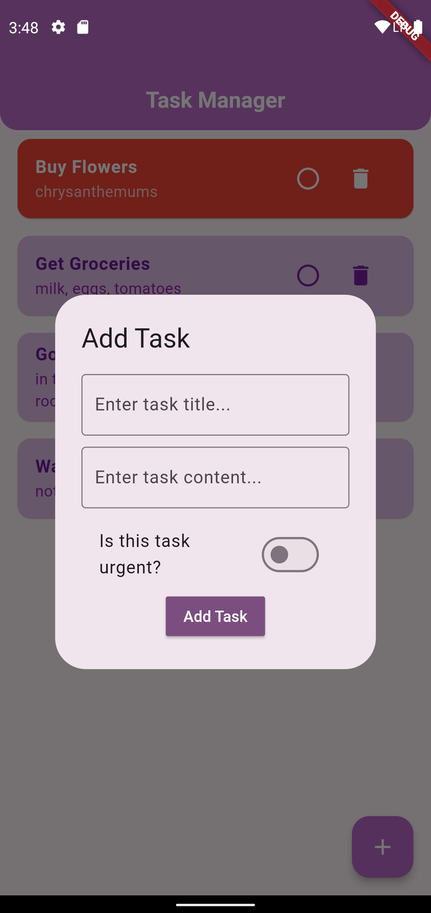
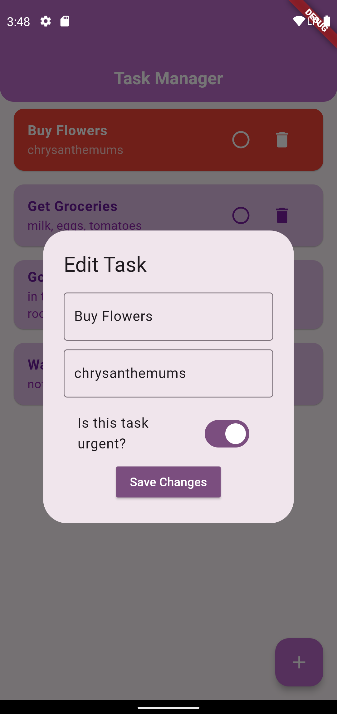
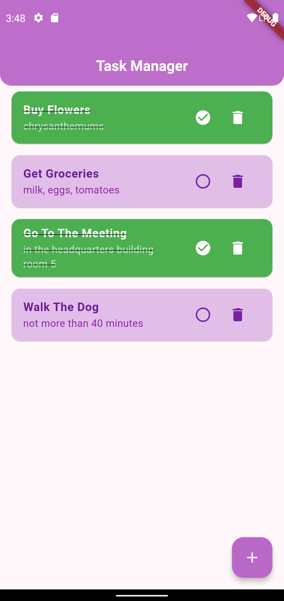

# Task Manager

A simple task management app built with Flutter (frontend) and Django (backend).

## Screenshots

<table>
  <tr>
    <td align="center" style="width: 50%; padding: 10px;">
      
      
<strong>Home Screen</strong>

    </td>
    <td align="center" style="width: 50%; padding: 10px;">
      
      
<strong>Add Task</strong>

    </td>
  </tr>
  <tr>
    <td align="center" style="width: 50%; padding: 10px;">
      
      
<strong>Edit Task</strong>

    </td>
    <td align="center" style="width: 50%; padding: 10px;">
      
      
<strong>Checked Tasks</strong>

    </td>
  </tr>
</table>

### Description

- **Home Screen**: Shows normal tasks in purple and urgent ones in red (urgent tasks stay on top).
- **Add Task**: Dialog for adding a new task.
- **Edit Task**: Dialog for modifying existing task information.
- **Checked Tasks**: Tasks marked as completed.

## License

This project is licensed under the MIT License. See the [LICENSE](LICENSE) file for details.
